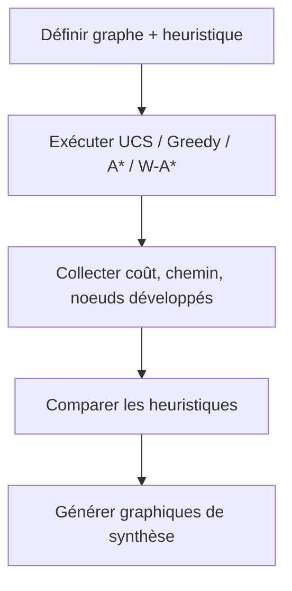
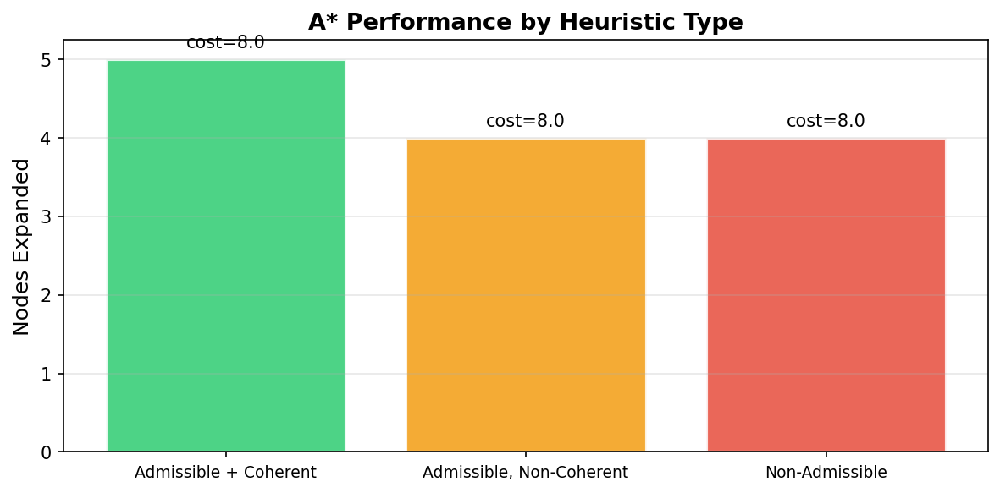
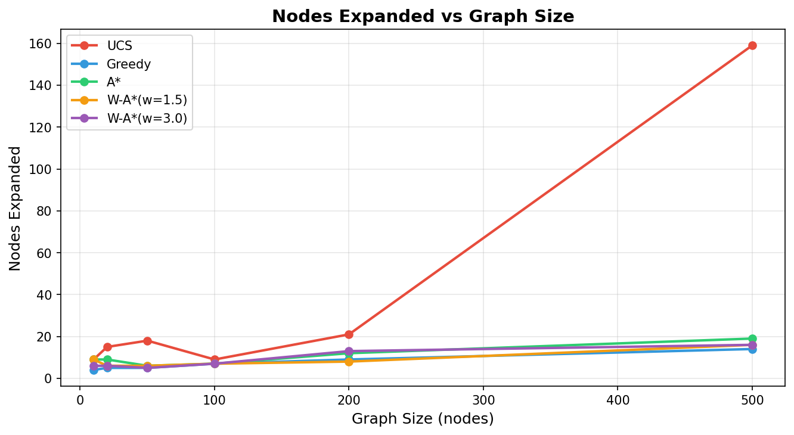
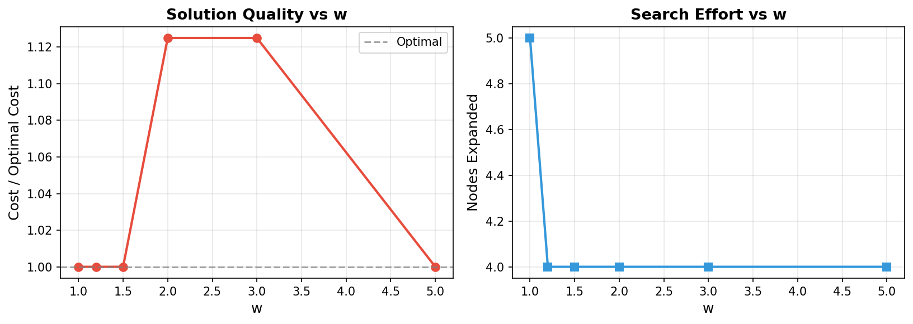
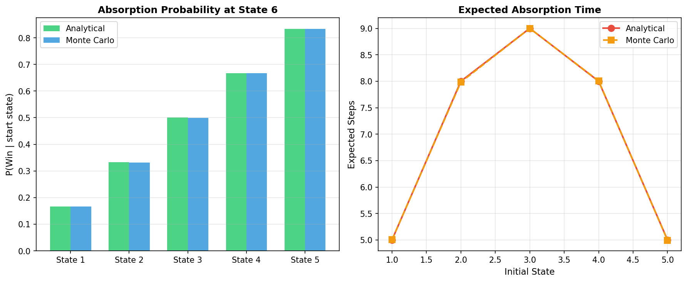
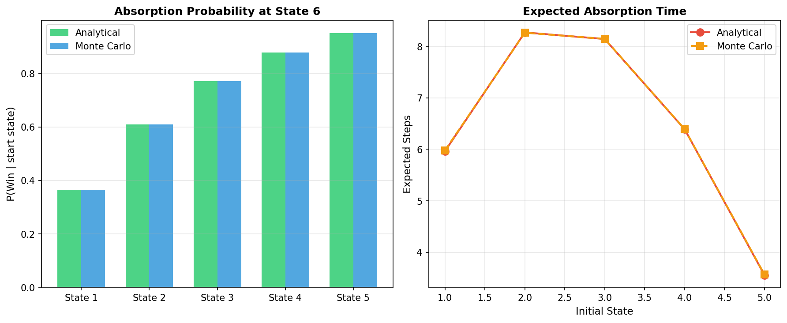

# Mini-Projet IA — Recherche Heuristique et Chaînes de Markov Absorbantes


Projet académique réalisé dans le cadre du module **Bases de l’IA (25_27)**, ENSET Mohammedia, Master SDIA.

---

## Sommaire

- [1) Présentation du projet](#1-présentation-du-projet)
- [2) Objectifs pédagogiques](#2-objectifs-pédagogiques)
- [3) Architecture du dépôt](#3-architecture-du-dépôt)
- [4) Installation](#4-installation)
- [5) Utilisation](#5-utilisation)
- [6) Méthodologie](#6-méthodologie)
  - [6.1 Recherche heuristique](#61-recherche-heuristique)
  - [6.2 Chaîne de Markov absorbante](#62-chaîne-de-markov-absorbante)
- [7) Formules mathématiques et implémentation](#7-formules-mathématiques-et-implémentation)
  - [7.1 UCS](#71-ucs)
  - [7.2 Greedy Best-First Search](#72-greedy-best-first-search)
  - [7.3 A*](#73-a)
  - [7.4 Weighted A*](#74-weighted-a)
  - [7.5 Markov absorbante](#75-markov-absorbante)
- [8) Visualisations et résultats](#8-visualisations-et-résultats)
- [9) Extensions réalisées](#9-extensions-réalisées)
- [10) Reproductibilité](#10-reproductibilité)
- [11) Limites et améliorations possibles](#11-limites-et-améliorations-possibles)
- [12) Références](#12-références)

---

## 1) Présentation du projet

Ce projet combine deux volets fondamentaux de l’IA :

1. **Recherche de chemin sur graphe orienté pondéré** avec UCS, Greedy BFS, A* et Weighted A*.
2. **Analyse probabiliste** avec une chaîne de Markov absorbante (problème de la ruine du joueur).

Le projet inclut :

- implémentation Python modulaire,
- expériences comparatives,
- figures de synthèse,
- validation Monte Carlo des résultats analytiques.

---

## 2) Objectifs pédagogiques

- Comprendre le rôle de la fonction d’évaluation `f(n)` selon l’algorithme.
- Mesurer l’impact de l’heuristique sur performance et optimalité.
- Étudier le compromis qualité/vitesse via Weighted A*.
- Utiliser les matrices `Q`, `R`, `N` pour analyser une chaîne absorbante.
- Vérifier expérimentalement les formules théoriques par simulation.

---

## 3) Architecture du dépôt

```text
IA_Project-main/
├── main.py
├── README.md
├── search/
│   ├── utils.py
│   ├── ucs.py
│   ├── greedy.py
│   └── astar.py
├── markov/
│   ├── absorbing_chain.py
│   └── simulation.py
└── experiments/
    ├── graphs.py
    ├── benchmarks.py
    ├── draw_graph.py
    ├── heuristic_comparison.png
    ├── nodes_expanded.png
    ├── weighted_astar.png
    ├── markov_absorption.png
    └── markov_absorption_asym.png
```

---

## 4) Installation

### Prérequis

- Python 3.8+
- pip

### Dépendances

```bash
pip install numpy matplotlib scipy
```

> Remarque : `scipy` est optionnel dans la version actuelle, mais peut servir pour des extensions analytiques.

---

## 5) Utilisation

### Exécution complète (recommandée)

```bash
python main.py
```

Cette commande exécute l’ensemble du pipeline :

- traces pas-à-pas (Greedy, A*),
- comparaison des heuristiques,
- test de scalabilité,
- expérience Weighted A*,
- analyse Markov (`p=0.5` et `p=0.6`) + validation Monte Carlo.

### Générer uniquement le graphe de référence

```bash
python experiments/draw_graph.py
```

---

## 6) Méthodologie

### 6.1 Recherche heuristique

Pipeline expérimental :



### 6.2 Chaîne de Markov absorbante

Pipeline analytique + simulation :

```mermaid
flowchart TD
    A[Construire matrice de transition P] --> B[Mettre en forme canonique: Q,R]
    B --> C[Calculer N = (I - Q)^(-1)]
    C --> D[Calculer B = N*R et t = N*1]
    D --> E[Valider par Monte Carlo]
    E --> F[Comparer analytique vs empirique]
```

---

## 7) Formules mathématiques et implémentation

### 7.1 UCS

**Formule**

```text
f(n) = g(n)
g(n) = coût cumulé du départ jusqu’à n
```

**Implémentation (extrait)**

```python
# search/ucs.py
tentative_g = g_score[current] + edge_cost
if tentative_g < g_score.get(neighbor, float('inf')):
    g_score[neighbor] = tentative_g
    heapq.heappush(open_list, (tentative_g, counter, neighbor))
```

### 7.2 Greedy Best-First Search

**Formule**

```text
f(n) = h(n)
```

**Implémentation (extrait)**

```python
# search/greedy.py
h = heuristic(neighbor, goal)
heapq.heappush(open_list, (h, counter, neighbor))
```

### 7.3 A*

**Formule**

```text
f(n) = g(n) + h(n)
```

**Conditions usuelles sur h**

```text
Admissibilité : h(n) <= h*(n)
Cohérence    : h(n) <= c(n,n') + h(n') pour toute arête (n,n')
```

**Implémentation (extrait)**

```python
# search/astar.py
tentative_g = g_score[current] + edge_cost
if tentative_g < g_score.get(neighbor, float('inf')):
    came_from[neighbor] = current
    g_score[neighbor] = tentative_g
    f = tentative_g + heuristic(neighbor, goal)
    heapq.heappush(open_list, (f, counter, neighbor))
```

### 7.4 Weighted A*

**Formule**

```text
f_w(n) = g(n) + w*h(n), avec w >= 1
```

**Implémentation (extrait)**

```python
# search/astar.py
f = tentative_g + w * heuristic(neighbor, goal)
heapq.heappush(open_list, (f, counter, neighbor))
```

### 7.5 Markov absorbante

**Formules**

```text
P(i -> i+1) = p
P(i -> i-1) = 1-p

P = [ I  0 ]
    [ R  Q ]

N = (I - Q)^(-1)
B = N*R
t = N*1
```

**Implémentation (extraits)**

```python
# markov/absorbing_chain.py
for i in range(1, n_states - 1):
    P[i, i + 1] = p
    P[i, i - 1] = 1 - p
```

```python
# markov/absorbing_chain.py
I = np.eye(Q.shape[0])
N = np.linalg.inv(I - Q)
B = N @ R
t = N @ np.ones(N.shape[1])
```

```python
# markov/simulation.py
if np.random.random() < p:
    state += 1
else:
    state -= 1
```

---

## 8) Visualisations et résultats

### Graphiques générés

- `experiments/heuristic_comparison.png`
- `experiments/nodes_expanded.png`
- `experiments/weighted_astar.png`
- `experiments/markov_absorption.png`
- `experiments/markov_absorption_asym.png`

### Aperçu visuel et explication (graphe par graphe)

#### 1) `heuristic_comparison.png` — Comparaison des heuristiques



- **But** : comparer l’impact du type d’heuristique sur A*.
- **Comment lire** : chaque barre représente le nombre de nœuds développés pour une heuristique donnée.
- **Interprétation** : moins de nœuds développés = recherche plus efficace.
- **À retenir** : une heuristique bien choisie réduit l’effort de recherche, mais une heuristique non admissible peut dégrader les garanties d’optimalité.

#### 2) `nodes_expanded.png` — Scalabilité des algorithmes



- **But** : observer l’évolution du coût de recherche quand la taille du graphe augmente.
- **Comment lire** : axe X = nombre de nœuds du graphe, axe Y = nœuds développés.
- **Interprétation** : une pente faible signifie une meilleure montée en charge.
- **À retenir** : A* reste en général plus économe que UCS sur les grands graphes, et Greedy peut être très rapide mais sans garantie d’optimalité.

#### 3) `weighted_astar.png` — Compromis qualité vs vitesse



- **But** : montrer l’effet du poids `w` dans Weighted A*.
- **Comment lire** :
    - sous-graphe gauche : ratio `coût_solution / coût_optimal` (qualité),
    - sous-graphe droit : nœuds développés (effort de recherche).
- **Interprétation** : quand `w` augmente, le nombre de nœuds baisse souvent, mais le coût peut augmenter.
- **À retenir** : ce graphe illustre le compromis classique entre rapidité et qualité de solution.

#### 4) `markov_absorption.png` — Validation Markov pour `p=0.5`



- **But** : comparer résultats analytiques et Monte Carlo dans le cas symétrique.
- **Comment lire** :
    - à gauche : probabilité de victoire par état initial,
    - à droite : temps moyen avant absorption.
- **Interprétation** : la proximité des courbes/barres analytique vs simulation valide le modèle.
- **À retenir** : pour `p=0.5`, les estimations empiriques confirment les formules matricielles.

#### 5) `markov_absorption_asym.png` — Validation Markov pour `p=0.6`



- **But** : analyser l’effet d’un biais favorable (`p > 0.5`).
- **Comment lire** : même structure que le graphe précédent, mais pour `p=0.6`.
- **Interprétation** : la probabilité de victoire augmente pour tous les états initiaux, surtout les états intermédiaires.
- **À retenir** : une légère augmentation de `p` modifie fortement les probabilités d’absorption finales.

### Résultats synthétiques

- Sur le graphe de référence, Greedy et A* trouvent un coût 8, mais seule A* garantit l’optimalité (si heuristique admissible).
- En grande taille, A* développe significativement moins de nœuds que UCS.
- En Weighted A*, augmenter `w` réduit souvent l’effort de recherche au prix d’une qualité potentiellement inférieure.
- Les estimations Monte Carlo sont cohérentes avec l’analyse matricielle Markov.

---

## 9) Extensions réalisées

- **E2** : génération de graphes aléatoires reproductibles.
- **E3** : étude multi-valeurs de `w` pour Weighted A*.
- **E4** : analyse asymétrique (`p=0.6`) pour la chaîne absorbante.

---

## 10) Reproductibilité

- Graphes aléatoires générés avec graine contrôlée.
- Simulation Monte Carlo configurable en nombre d’essais.
- Exécution standard unique via `python main.py`.

---

## 11) Limites et améliorations possibles

- Ajouter des tests unitaires automatisés par module.
- Étendre l’étude à d’autres topologies de graphes (grilles, graphes denses, cycles complexes).
- Ajouter des heuristiques apprises ou basées données.
- Produire un export automatique des résultats (CSV/JSON + rapport PDF).

---

## 12) Références

1. Russell, S. & Norvig, P. (2020). *Artificial Intelligence: A Modern Approach* (4e éd.).
2. Hart, P. E., Nilsson, N. J., & Raphael, B. (1968). A formal basis for the heuristic determination of minimum cost paths.
3. Pohl, I. (1970). Heuristic search viewed as path finding in a graph.
4. Kemeny, J. G., & Snell, J. L. (1976). *Finite Markov Chains*.

---

